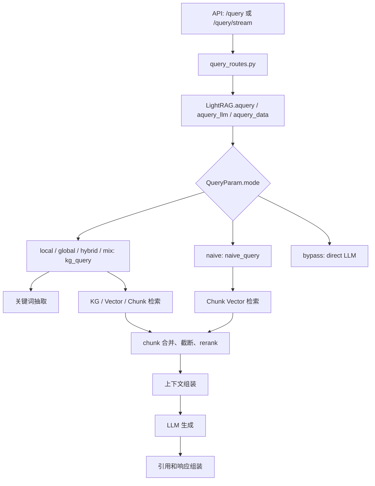
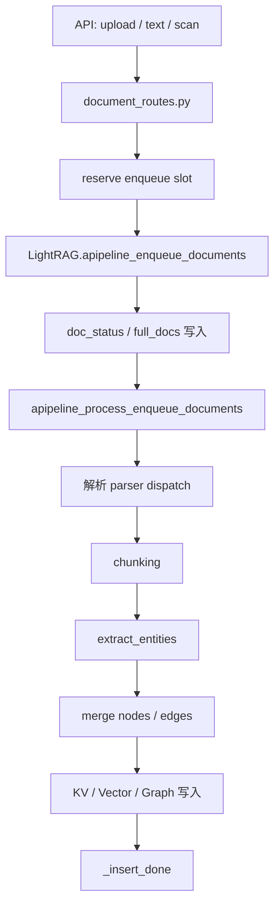

# LightRAG 后端结构调整计划

## 1. 文档目标

本文档只分析并规划后端代码结构调整，不涉及前端改造。

调整目标是：在不改变现有功能、接口、配置项和存储行为的前提下，把当前后端中职责过重的大文件逐步拆成更清晰的模块，让后续维护、问题排查、测试覆盖和功能扩展更容易。

本计划基于当前仓库结构：

| 当前模块 | 主要职责 | 当前问题 |
|---|---|---|
| `lightrag/lightrag.py` | `LightRAG` 主入口、存储初始化、插入、查询、删除、配置组装 | 已经引入 mixin，但主类仍承担较多编排逻辑 |
| `lightrag/operate.py` | 实体关系抽取、图谱重建、查询模式、关键词抽取、上下文构造 | 文件过大，抽取逻辑和检索逻辑耦合，排查问题成本高 |
| `lightrag/pipeline.py` | 文档入队、处理流水线、解析调度、多模态分析、并发状态控制 | 已抽成 `_PipelineMixin`，但内部阶段仍集中在一个大文件 |
| `lightrag/utils.py` | LLM 缓存、并发包装、token 工具、rerank、chunk 处理、引用格式化 | 工具职责过杂，容易形成循环依赖 |
| `lightrag/api/lightrag_server.py` | FastAPI 应用创建、供应商配置、rerank 初始化、静态资源、启动入口 | 应用工厂和 provider 构建逻辑混在一起 |
| `lightrag/api/routers/document_routes.py` | 文档上传、扫描、删除、状态、解析、后台任务 | 路由层、业务服务、文件解析和并发保护混在一起 |
| `lightrag/api/routers/query_routes.py` | 查询接口、流式响应、引用处理、请求响应模型 | API schema、响应组装和业务调用边界不够清晰 |

## 2. 调整原则

| 原则 | 说明 |
|---|---|
| 先搬迁，后重写 | 第一阶段只移动代码和补适配层，不改变核心逻辑 |
| 保持 public API 不变 | `LightRAG`、`QueryParam`、`ainsert`、`aquery`、API endpoint 路径保持兼容 |
| 保持导入兼容 | 原 `lightrag.operate`、`lightrag.utils` 中被外部使用的函数先保留 wrapper 或 re-export |
| 保持存储行为不变 | 不改变 KV、Vector、Graph、DocStatus 的写入顺序和命名空间规则 |
| 保持并发契约不变 | `pipeline_status` 中 `busy`、`destructive_busy`、`scanning` 等字段的互斥规则不变 |
| 先补测试再拆模块 | 每一阶段先确认覆盖关键行为，再移动代码 |
| 日志要能定位链路 | 查询、入库、抽取、rerank、删除都应带稳定的 `query_id`、`track_id` 或 `doc_id` |

## 3. 目标结构

建议目标结构如下。为了避免和现有 `lightrag/utils.py`、`lightrag/pipeline.py` 文件命名冲突，第一阶段新增目录使用 `common/` 和 `pipeline_parts/`，等兼容期结束后再考虑是否彻底改名。

```text
lightrag/
  lightrag.py
  operate.py
  pipeline.py
  utils.py

  query/
    __init__.py
    service.py
    modes.py
    keywords.py
    kg_search.py
    context.py
    chunks.py
    references.py

  extraction/
    __init__.py
    service.py
    json_mode.py
    text_mode.py
    merge.py
    rebuild.py
    summaries.py

  pipeline_parts/
    __init__.py
    enqueue.py
    processing.py
    parsing.py
    scan.py
    destructive.py
    status.py
    multimodal.py

  common/
    __init__.py
    async_tools.py
    llm_cache.py
    token_tools.py
    chunk_processing.py
    logging_context.py

  api/
    lightrag_server.py
    app_factory.py
    provider_factory.py
    health.py
    response_builders.py
    schemas/
      __init__.py
      query.py
      documents.py
    services/
      __init__.py
      documents.py
      uploads.py
      scans.py
      destructive_jobs.py
```

兼容期内，`operate.py`、`pipeline.py`、`utils.py` 不应立刻删除，而是作为旧导入路径的 facade：

```python
# 示例：lightrag/operate.py
from lightrag.query.service import kg_query, naive_query
from lightrag.extraction.service import extract_entities
```

## 4. 主要调用链路

### 4.1 查询链路



调整后建议边界：

| 逻辑 | 目标模块 |
|---|---|
| 查询入口编排 | `lightrag/query/service.py` |
| mode 分发 | `lightrag/query/modes.py` |
| 关键词抽取 | `lightrag/query/keywords.py` |
| 图谱检索 | `lightrag/query/kg_search.py` |
| chunk 合并、截断、rerank | `lightrag/query/chunks.py` 或 `lightrag/common/chunk_processing.py` |
| 上下文字符串构造 | `lightrag/query/context.py` |
| 引用列表生成 | `lightrag/query/references.py` |
| API 响应封装 | `lightrag/api/response_builders.py` |

### 4.2 文档入库链路



调整后建议边界：

| 逻辑 | 目标模块 |
|---|---|
| 上传参数校验、文件保存 | `lightrag/api/services/uploads.py` |
| 文档入队状态保护 | `lightrag/pipeline_parts/enqueue.py` |
| pipeline 状态读写 | `lightrag/pipeline_parts/status.py` |
| 扫描流程 | `lightrag/api/services/scans.py` + `lightrag/pipeline_parts/scan.py` |
| 删除、清空等破坏性任务 | `lightrag/api/services/destructive_jobs.py` + `lightrag/pipeline_parts/destructive.py` |
| 解析调度 | `lightrag/pipeline_parts/parsing.py` |
| 多模态分析 | `lightrag/pipeline_parts/multimodal.py` |
| 实体关系抽取 | `lightrag/extraction/service.py` |

## 5. 分阶段调整计划

### 阶段 0：补基线测试和链路快照

| 调整模块 | 如何调整 | 验证点 |
|---|---|---|
| `tests/` | 增加或确认查询、入库、删除、rerank、JSON 抽取的最小行为测试 | 作为后续拆分的回归保护 |
| `lightrag/api/routers/query_routes.py` | 固化 `/query`、`/query/stream`、`/query/data` 的响应结构测试 | 保证 API 返回不变 |
| `lightrag/pipeline.py` | 固化并发状态测试，尤其是 enqueue、scan、clear/delete 的互斥行为 | 保证并发契约不变 |
| `lightrag/operate.py` | 固化 `local`、`global`、`hybrid`、`mix`、`naive` 的调用行为测试 | 保证检索模式不变 |

建议先跑：

```bash
./scripts/test.sh tests/test_aquery_data_endpoint.py
./scripts/test.sh tests/test_keyword_parsing.py
./scripts/test.sh tests/test_rerank_chunking.py
./scripts/test.sh tests/test_pipeline_cancellation.py
./scripts/test.sh tests/test_unified_lock_safety.py
```

### 阶段 1：拆 API 响应和 schema

| 调整模块 | 如何调整 | 不改变功能的方式 |
|---|---|---|
| `lightrag/api/routers/query_routes.py` | 把 `QueryRequest`、`QueryResponse`、`ReferenceItem` 等模型移动到 `lightrag/api/schemas/query.py` | 原文件继续从新模块导入 |
| `lightrag/api/routers/document_routes.py` | 把文档相关 Pydantic 模型移动到 `lightrag/api/schemas/documents.py` | endpoint 路径、字段名、默认值不变 |
| `lightrag/api/response_builders.py` | 新增 query 响应、stream chunk、reference 格式化函数 | 只抽函数，不改响应内容 |

收益：

| 收益 | 说明 |
|---|---|
| API 文件更短 | 路由函数只保留 HTTP 层逻辑 |
| 响应更好测试 | response builder 可直接单测 |
| 后续改引用格式风险更小 | 引用逻辑集中 |

### 阶段 2：拆查询逻辑

| 调整模块 | 如何调整 | 不改变功能的方式 |
|---|---|---|
| `lightrag/query/service.py` | 承接 `kg_query`、`naive_query` 的主入口 | `operate.py` 保留同名导出 |
| `lightrag/query/keywords.py` | 移动 `get_keywords_from_query`、`extract_keywords_only`、关键词 JSON 解析 | prompt 和解析容错逻辑保持原样 |
| `lightrag/query/kg_search.py` | 移动 `_perform_kg_search`、entity / relation 数据拉取函数 | storage 调用顺序保持原样 |
| `lightrag/query/context.py` | 移动 `_build_query_context`、`_build_context_str`、token 截断相关查询上下文逻辑 | 输出 context 字符串保持快照一致 |
| `lightrag/query/chunks.py` | 移动 chunk 合并、source 合并、rerank 前后处理 | rerank 调用条件保持 `QueryParam.enable_rerank` |
| `lightrag/query/modes.py` | 固化 `local`、`global`、`hybrid`、`mix`、`naive` 的 mode 分发 | 对外 mode 名称不变 |

推荐拆分顺序：

1. 先移动纯函数，例如关键词解析、markdown code fence 清理。
2. 再移动只依赖 storage 的查询 helper。
3. 最后移动 `kg_query`、`naive_query` 主流程。
4. 每移动一组函数，就让 `operate.py` re-export 一次并跑对应测试。

### 阶段 3：拆抽取逻辑

| 调整模块 | 如何调整 | 不改变功能的方式 |
|---|---|---|
| `lightrag/extraction/service.py` | 承接 `extract_entities` 主流程 | `operate.py` 保留 wrapper |
| `lightrag/extraction/text_mode.py` | 移动文本分隔符模式下的实体和关系解析 | 原 prompt、分隔符、fallback 不变 |
| `lightrag/extraction/json_mode.py` | 移动 JSON 抽取结果识别和解析 | `ENTITY_EXTRACTION_USE_JSON` 行为不变 |
| `lightrag/extraction/merge.py` | 移动节点、边合并和 upsert 逻辑 | storage 写入顺序不变 |
| `lightrag/extraction/rebuild.py` | 移动从 chunk 重建图谱的逻辑 | 对已有 rebuild 入口兼容 |
| `lightrag/extraction/summaries.py` | 移动实体和关系 summary 生成逻辑 | LLM 调用、缓存、token 限制不变 |

这一阶段需要特别保护：

| 风险点 | 保护方式 |
|---|---|
| JSON 抽取和文本抽取结果不一致 | 建立相同输入的结构快照测试 |
| merge 后 entity / relation 属性丢失 | 对 merge 结果做字段级断言 |
| rebuild 影响已有数据 | 使用临时 workspace 做测试 |

### 阶段 4：拆 pipeline 阶段

| 调整模块 | 如何调整 | 不改变功能的方式 |
|---|---|---|
| `lightrag/pipeline_parts/status.py` | 集中 pipeline status 字段读写和锁操作 | 字段名和互斥规则完全不变 |
| `lightrag/pipeline_parts/enqueue.py` | 移动 dedup、full_docs 写入、doc_status 写入 | 保持 full_docs 与 doc_status 写入顺序 |
| `lightrag/pipeline_parts/processing.py` | 移动 batch loop、pending 文档处理、错误处理 | batch 行为和 request_pending 行为不变 |
| `lightrag/pipeline_parts/parsing.py` | 移动 `parse_native`、`parse_mineru`、`parse_docling` 调度 | parser routing 行为不变 |
| `lightrag/pipeline_parts/scan.py` | 移动 scan 分类和扫描任务逻辑 | `scanning`、`scanning_exclusive` 语义不变 |
| `lightrag/pipeline_parts/destructive.py` | 移动 clear/delete 的 pipeline busy 保护 | `destructive_busy` 语义不变 |
| `lightrag/pipeline_parts/multimodal.py` | 移动多模态分析和增强逻辑 | prompt、缓存、图片处理不变 |

兼容方式：

```python
# lightrag/pipeline.py 保留 _PipelineMixin
class _PipelineMixin:
    from lightrag.pipeline_parts.enqueue import apipeline_enqueue_documents
    from lightrag.pipeline_parts.processing import apipeline_process_enqueue_documents
```

如果直接把方法赋值到 mixin 可读性不好，也可以保留薄 wrapper：

```python
async def apipeline_enqueue_documents(self, *args, **kwargs):
    return await enqueue_documents(self, *args, **kwargs)
```

### 阶段 5：拆通用工具

| 调整模块 | 如何调整 | 不改变功能的方式 |
|---|---|---|
| `lightrag/common/async_tools.py` | 移动并发限流、priority wrapper、retry 相关工具 | `utils.py` re-export |
| `lightrag/common/llm_cache.py` | 移动 LLM cache key、cache 读写、cache wrapper | cache key 快照测试保护 |
| `lightrag/common/token_tools.py` | 移动 token 计数、截断、文本清理 | token 截断结果保持一致 |
| `lightrag/common/chunk_processing.py` | 移动 `process_chunks_unified`、`apply_rerank_if_enabled` | rerank 测试保护 |
| `lightrag/common/logging_context.py` | 新增链路 ID 和结构化日志辅助 | 只增加日志字段，不改变业务行为 |

注意：

| 注意点 | 说明 |
|---|---|
| 不建议第一步创建 `lightrag/utils/` 目录 | 现有 `utils.py` 会产生命名冲突 |
| `utils.py` 先保留 | 外部项目可能直接 import `lightrag.utils` |
| re-export 要有弃用周期 | 后续再考虑 deprecation warning |

### 阶段 6：拆 API 服务层

| 调整模块 | 如何调整 | 不改变功能的方式 |
|---|---|---|
| `lightrag/api/provider_factory.py` | 移动 LLM、embedding、rerank、role provider 构建 | env 名称和默认值不变 |
| `lightrag/api/app_factory.py` | 移动 FastAPI app 创建、middleware、router 注册 | `lightrag_server.py::get_application` 保持入口兼容 |
| `lightrag/api/health.py` | 移动 frontend、MinerU、Docling、workspace 状态构造 | 返回字段不变 |
| `lightrag/api/services/documents.py` | 移动文档列表、状态统计、分页处理 | 路由只负责参数和 response |
| `lightrag/api/services/uploads.py` | 移动上传保存、文件名清理、文件解析入口 | 文件安全校验不变 |
| `lightrag/api/services/scans.py` | 移动扫描任务编排 | 与 pipeline status 契约保持一致 |
| `lightrag/api/services/destructive_jobs.py` | 移动删除、清空、后台任务 | 破坏性任务互斥规则不变 |

收益：

| 收益 | 说明 |
|---|---|
| API 排查更清晰 | HTTP 层、业务层、pipeline 层分离 |
| provider 配置更集中 | rerank、role LLM、embedding 的配置错误更容易定位 |
| 文档路由更安全 | 文件删除、扫描、上传逻辑集中测试 |

### 阶段 7：收敛 `LightRAG` 主类

| 调整模块 | 如何调整 | 不改变功能的方式 |
|---|---|---|
| `lightrag/lightrag.py` | 保留构造、存储初始化、public API 和跨流程编排 | 不改变 `LightRAG(...)` 参数 |
| `lightrag/query/mixin.py` | 可选新增 `_QueryMixin`，承接 `aquery`、`aquery_llm`、`aquery_data` 的薄编排 | 对外方法名不变 |
| `lightrag/deletion/mixin.py` | 可选新增 `_DeletionMixin`，承接删除相关 public 方法 | 删除行为不变 |
| `lightrag/storage_context.py` | 可选新增 storage 上下文对象，减少函数参数传递 | 先内部使用，不暴露 public API |

建议最终组合：

```text
LightRAG
  -> _RoleLLMMixin
  -> _StorageMigrationMixin
  -> _PipelineMixin
  -> _QueryMixin
  -> _DeletionMixin
```

如果担心 mixin 过多，也可以不继续增加 mixin，而是让 `LightRAG` 调用 service 对象。两种方式中，更推荐 service 对象，因为更容易测试，也更少依赖继承顺序。

## 6. 可维护性和排查能力增强

### 6.1 增加链路 ID

| 场景 | 建议字段 |
|---|---|
| 查询请求 | `query_id`、`mode`、`stream`、`top_k`、`chunk_top_k` |
| 文档上传 | `track_id`、`doc_id`、`file_path`、`workspace` |
| pipeline batch | `batch_id`、`pending_count`、`failed_count` |
| 实体抽取 | `doc_id`、`chunk_id`、`entity_count`、`relation_count` |
| rerank | `query_id`、`before_count`、`after_count`、`rerank_model` |
| 删除任务 | `job_id`、`doc_id`、`workspace`、`destructive_busy` |

### 6.2 增加阶段耗时

建议对以下阶段打耗时日志：

| 阶段 | 价值 |
|---|---|
| keyword extraction | 判断查询慢是否来自 LLM 关键词抽取 |
| vector search | 判断向量库延迟 |
| graph fetch | 判断图数据库延迟 |
| chunk merge/truncate | 判断上下文构建成本 |
| rerank | 判断 rerank 模型耗时 |
| llm generation | 判断最终生成耗时 |
| document parse | 判断文件解析耗时 |
| entity extraction | 判断抽取模型耗时 |
| storage upsert | 判断写库瓶颈 |

### 6.3 错误分层

建议后续统一错误类型：

| 错误类型 | 示例 |
|---|---|
| `ConfigurationError` | provider、embedding、rerank 配置错误 |
| `StorageOperationError` | KV、Vector、Graph、DocStatus 读写失败 |
| `PipelineBusyError` | scan、clear、delete、enqueue 并发冲突 |
| `DocumentParseError` | PDF、DOCX、MinerU、Docling 解析失败 |
| `ExtractionError` | 实体关系抽取失败 |
| `QueryBuildError` | 查询上下文构造失败 |
| `RerankError` | rerank 服务调用失败 |

## 7. 回归验证清单

每个阶段完成后至少验证：

| 验证项 | 说明 |
|---|---|
| 单元测试 | 运行相关模块测试 |
| API 兼容 | endpoint 路径、请求字段、响应字段不变 |
| 导入兼容 | 原 `lightrag.operate`、`lightrag.utils` 导入路径仍可用 |
| 查询模式 | `local`、`global`、`hybrid`、`mix`、`naive` 行为不变 |
| rerank | `enable_rerank=True/False` 行为不变 |
| JSON 抽取 | `ENTITY_EXTRACTION_USE_JSON=true/false` 行为不变 |
| pipeline 并发 | upload、scan、clear、delete 互斥规则不变 |
| 存储数据 | workspace 隔离、collection 名、payload 过滤不变 |
| 日志 | 新增日志不泄露 API key、token、密码 |

建议命令：

```bash
ruff check .
./scripts/test.sh tests
```

前端无关时不需要跑 WebUI 测试。

## 8. 推荐落地顺序

| 顺序 | 阶段 | 原因 |
|---|---|---|
| 1 | 阶段 0：补测试 | 没有基线保护时拆大文件风险最高 |
| 2 | 阶段 1：拆 API schema 和 response builder | 低风险，收益明显 |
| 3 | 阶段 5：先拆部分通用工具 | 可减少后续 query/extraction 的依赖压力 |
| 4 | 阶段 2：拆查询逻辑 | 查询链路用户感知最强，拆完后排查收益最大 |
| 5 | 阶段 3：拆抽取逻辑 | 抽取链路复杂，但可通过测试保护 |
| 6 | 阶段 4：拆 pipeline | 并发状态敏感，放在测试更完善后执行 |
| 7 | 阶段 6：拆 API 服务层 | 前面核心 service 稳定后再整理路由 |
| 8 | 阶段 7：收敛 `LightRAG` 主类 | 最后再清理主入口，减少中途震荡 |

## 9. 不建议立即做的事情

| 不建议事项 | 原因 |
|---|---|
| 一次性重写 `operate.py` | 查询和抽取都在里面，风险过高 |
| 直接删除 `utils.py` | 外部导入兼容风险高 |
| 直接改存储接口 | 会影响所有后端实现和工作区隔离 |
| 同时改 API 响应格式 | 会影响 WebUI 和外部调用方 |
| 先做目录大搬迁再补测试 | 难以判断错误来自搬迁还是原逻辑 |
| 在拆 pipeline 时顺手改并发规则 | 容易引入上传、扫描、删除之间的数据竞争 |

## 10. 最终验收标准

结构调整完成后，理想状态是：

| 验收标准 | 目标 |
|---|---|
| `operate.py` | 只保留兼容导出或极薄入口 |
| `pipeline.py` | 只保留 `_PipelineMixin` 和少量编排 |
| `utils.py` | 只保留稳定公共工具和兼容导出 |
| `lightrag.py` | 聚焦 `LightRAG` public API 和核心生命周期 |
| API routers | 只处理 HTTP 参数、鉴权、response，不承载复杂业务 |
| 查询问题排查 | 能通过 `query_id` 定位关键词、检索、rerank、LLM 各阶段 |
| 入库问题排查 | 能通过 `track_id/doc_id` 定位上传、解析、chunk、抽取、写库各阶段 |
| 测试覆盖 | 查询、抽取、pipeline 并发、API 响应都有稳定回归测试 |

## 11. 一句话总结

本次后端结构调整不应该是“大拆大改”，而应该是有测试保护的渐进式搬迁：先把 API 响应、通用工具、查询、抽取、pipeline 阶段逐步拆出来，让 `LightRAG` 保持稳定入口，让旧模块保留兼容导出，最终形成更容易读、容易测、容易定位问题的后端结构。
